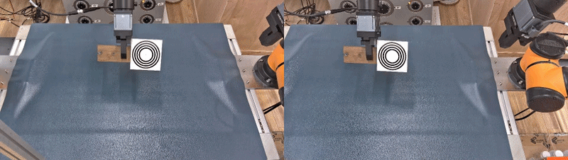
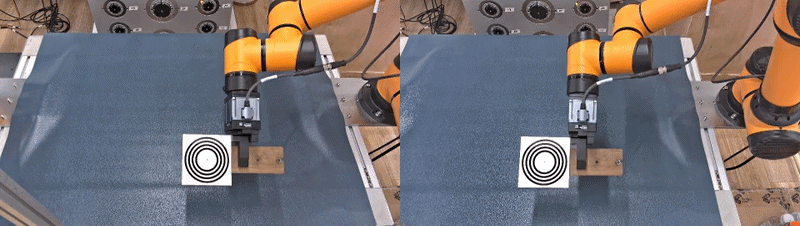
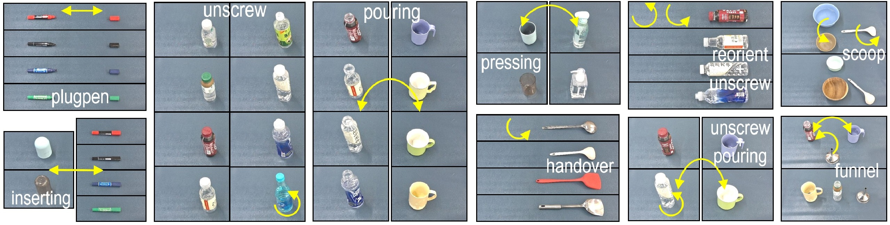

# DualArmAubo
This is a platform with a contralateral fixed-base dual-arm manipulator, a Kingfisher R-6000 binocular camera and two DH-Robotics PGI-80-80 parallel grippers. It has been utilized in our projects like [VLBiMan](https://hnuzhy.github.io/projects/VLBiMan), [BiDemoSyn](https://hnuzhy.github.io/projects/BiDemoSyn), and [VLBiMan++](https://hnuzhy.github.io/projects/VLBiManPlus).

  * **ICLR2026(arxiv2025.09)** VLBiMan: Vision-Language Anchored One-Shot Demonstration Enables Generalizable Bimanual Robotic Manipulation [[paper link](https://proceedings.iclr.cc/paper_files/paper/2026/hash/b6583edd75bc7d5fd21afb59837f0164-Abstract-Conference.html)][[project link](https://hnuzhy.github.io/projects/VLBiMan)]
  * **RSS2026(arxiv2025.12)** One-Shot Real-World Demonstration Synthesis for Scalable Bimanual Manipulation [[paper link](https://www.roboticsproceedings.org/rss22/p001.html)][[project link](https://hnuzhy.github.io/projects/BiDemoSyn/)]
  * **(arxiv2026.09)** VLBiMan++: Expanding the Generalization Boundary of Vision-Language Anchored One-Shot Bimanual Manipulation [[pdf link](https://hnuzhy.github.io/projects/VLBiManPlus/manu_VLBiMan++.pdf)][[project link](https://hnuzhy.github.io/projects/VLBiManPlus)]

## Step 1: Hand-Eye Calibration
The hand-eye calibration referred to here is the calibration of the 4×4 transformation matrix for an "eye-to-hand" (or "eye-outside-hand") configuration. The primary objective is to transform 6-DoF poses from the head-mounted egocentric camera frame to the robotic arm's coordinate system (and vice versa). For further theoretical explanations, please refer to [arXiv](https://arxiv.org/abs/2311.12655) and [Wikipedia](https://en.wikipedia.org/wiki/Hand%E2%80%93eye_calibration_problem). In practice, we consistently use the left-eye view of the binocular stereo camera as the primary perspective for all calibration procedures. In the dual-arm manipulation platform, each robotic arm requires individual calibration. Additionally, we consistently use a concentric-circle calibration plate. Examples can be found in folders [saved_imgs_eeps_s1_arm1/arm2](./binocularCam/example_kfr/) or in the animated GIF below.

<table>
  <tr>
    <td align="center" width=50%> Hand-Eye Calibration of Left-Arm </td>
    <td align="center" width=50%> Hand-Eye Calibration of Right-Arm </td>
  </tr>
  <tr>
    <td align="center" width=50%></td>
    <td align="center" width=50%></td>
  </tr>
</table>

For the calibration scripts used in this project, please refer to [handeye_Calib_kfr.py](./scripts_kfr/handeye_Calib_kfr.py) and [handeye_Rlia_kfr.py](./scripts_kfr/handeye_Rlia_kfr.py). The former `handeye_Calib_kfr.py` is used to drive the robotic arm to assume 24 diverse poses—creating a variety of cases—and capture keyframes, while the latter `handeye_Rlia_kfr.py` is used to invoke DexForce’s proprietary [rlia](https://huggingface.co/HoyerChou/YOTO/blob/main/wheels/rlia-0.3.4-cp310-cp310-manylinux_2_31_x86_64.whl) library for the quick and convenient calibration of transformation matrices. In the absence of errors, the calibration accuracy (e.g., Reprojection Error) is typically around 0.1 cm or better. 

## Step 2: One-Shot Demonstration
We collect one-shot demonstrations via kinesthetic teaching: an operator manually guides both arms through task-critical waypoints, recording the 6-DoF end-effector poses (relative to each robot base frame) and gripper binary states at each pause. Objects are placed in fixed initial configurations (allowing small positional tolerance) to ensure consistency. The recorded waypoints are then executed autonomously by the robot control API, which solves inverse kinematics between consecutive given poses and synchronizes gripper actions (e.g., closing after reaching a pre-grasp pose). During auto-execution, stereo camera observations (10Hz) and dual-arm joint/end-effector states are logged. For the real rollout effect of the one-shot demonstration related to each task, please refer to our projects [VLBiMan](https://hnuzhy.github.io/projects/VLBiMan) or [BiDemoSyn](https://hnuzhy.github.io/projects/BiDemoSyn/). Finally, demonstrations are deconstructed into task-aware blocks to support subsequent adaptive reusing and trajectory synthesis.

We primarily defined and implemented up to ten bimanual tasks on this dual-arm platform: `plugpen`, `inserting`, `unscrew`, `pouring`, `pressing`, `reorient(handover)`, `reorient+unscrew`, `unscrew+pouring`, `tool-use:spoon`, and `tool-use:funnel`. The keyposes or waypoints generated after a single one-shot demonstration of each task are recorded in a `JSON` file. Please refer to the folder [outputs](./outputs/) for details. Regarding the initial pose and placement of the objects to be manipulated for each task, please refer to the folder [seedinit](./seedinit/). Each task may involve multiple target objects or groups of objects. Consequently, more than one `JSON` file might be generated to record the keyposes throughout the manipulation, as variations in size and shape among objects of the same category can influence the movements required for certain adjustable steps. 

## Step 3: Environment Configuration
Following the initial calibration and demonstration phases, this project requires the configuration and installation of specific Vision-Language Models (VLMs) or Vision Foundation Models (VFMs). Two types of approaches are employed in this platform.

The first approach is [YOLOE (ICCV2025)](https://github.com/THU-MIG/yoloe), a lightweight and convenient VLM/VFM. It supports open-vocabulary object detection and segmentation without prompts (similar to SAM) and can also utilize prompts to detect and segment specific objects, though it exhibits lower stability and precision, and produces relatively coarse mask boundaries. I recommend a choice similar to this project: directly install the `ultralytics` package and utilize the pre-encapsulated [YOLOE](https://docs.ultralytics.com/zh/models/yoloe) interface within it (e.g., `from ultralytics import YOLOE`).

The second approach leverages the mature and powerful VLM model [Florence-2 (CVPR2024)](https://arxiv.org/abs/2311.06242) and VFM model [SAM2 (ICLR2025)](https://arxiv.org/abs/2408.00714) separately. This enables more robust and precise detection and segmentation of target objects, but the drawback is the significant processing time—typically requiring several hundred milliseconds per image—which results in brief stutters between keyposes during closed-loop control. Regarding usage: although `ultralytics` integrates [SAM2](https://docs.ultralytics.com/zh/models/sam-2), it does not support text prompt inputs. Therefore, I recommend downloading the weights for [Florence-2-base](https://huggingface.co/microsoft/Florence-2-base) and [SAM2-hiera-small](https://huggingface.co/facebook/sam2-hiera-small) yourself, and then using the [scripts](./kingFisherR/vlm_utils/) provided in this project to implement the combined `Florence-2 + SAM2` solution.

## Step 4: Dynamic Closed-Loop Manipulation
Next, we move to the execution phase of bimanual manipulation. Here, we primarily demonstrate how to achieve training-free, robust, and generalizable manipulation—based on a `one-shot demonstration`—that handles disturbances (this corresponds to the full workflow discussed in [VLBiMan](https://hnuzhy.github.io/projects/VLBiMan)). For the approach of using a trained visuomotor policy to predict the sequence of all future bimanual keyframes (as seen in [BiDemoSyn](https://hnuzhy.github.io/projects/BiDemoSyn/)), one can refer to the [BiDP](https://github.com/hnuzhy/YOTO/tree/main/BiDP) algorithm previously proposed in [YOTO](https://hnuzhy.github.io/projects/YOTO). 

Specifically, we implemented two closed-loop control schemes driven by different VLM/VFM combinations in scripts [run_Real_Rollout_v1.py](./scripts_kfr/run_Real_Rollout_v1.py) and [run_Real_Rollout_v2.py](./scripts_kfr/run_Real_Rollout_v2.py). While they share the same core control logic and code framework, `run_Real_Rollout_v1.py` utilizes the lightweight [YOLOE](https://github.com/THU-MIG/yoloe), whereas `run_Real_Rollout_v2.py` employs the more computationally intensive yet reliable [Florence-2](https://arxiv.org/abs/2311.06242) + [SAM2](https://arxiv.org/abs/2408.00714) setup, with each serving distinct purposes. To achieve closed-loop control, consistent with the methodology described in the [VLBiMan](https://hnuzhy.github.io/projects/VLBiMan) paper, we focus on addressing changes in the target object's pose during the `pre-grasping` phase. By comparing the current state against the `seed pose` from the one-shot demonstration, we calculate positional offsets or rotational changes to derive a new 6-DoF grasping pose. Since these computations are performed with minimal CPU overhead, the system enables high-frequency, robust closed-loop control.

## Step 5: Real-World Data Collection (BiDemoSyn)
This step is optional and applies only to the real-world data collection component of the [BiDemoSyn](https://hnuzhy.github.io/projects/BiDemoSyn/) paper. Specifically, we utilize the script [run_Data_Collect.py](./scripts_kfr/run_Data_Collect.py) to facilitate the rapid, dense collection of pre-grasping keyframes in real-world settings, as well as the quick adjustment and synthesis of manipulation trajectories. This process leverages the lightweight [YOLOE](https://github.com/THU-MIG/yoloe) model—which demonstrated excellent performance across the six dual-arm manipulation tasks (e.g., `plugpen`, `inserting`, `unscrew`, `pouring`, `pressing`, and `reorient(handover)`) featured in the BiDemoSyn paper—enabling us to rapidly acquire and synthesize thousands of demonstrations. For concrete examples of the dynamic sequences, please refer to our released dataset [BiDemoSyn-Data](https://huggingface.co/datasets/HoyerChou/BiDemoSyn-Data).

