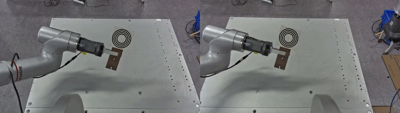
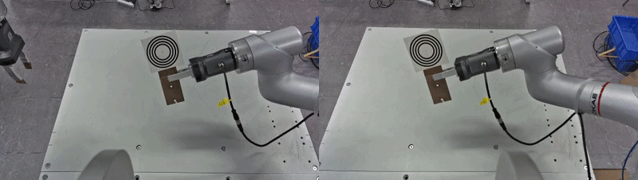
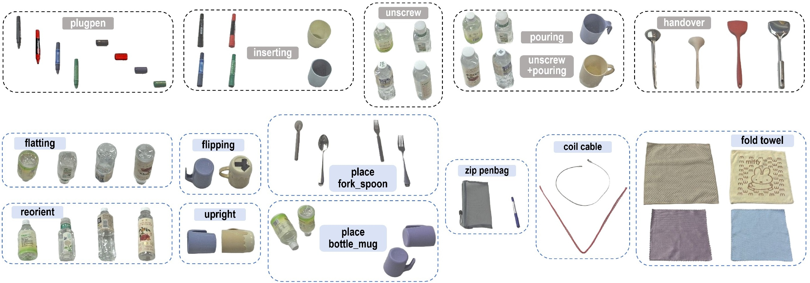
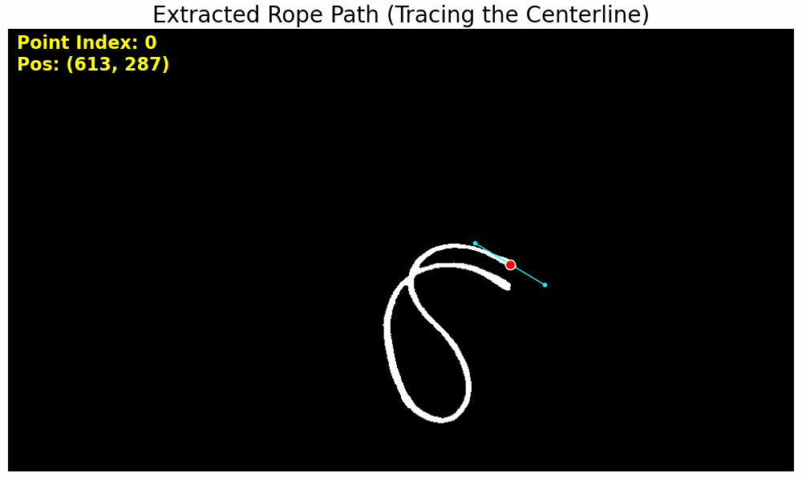
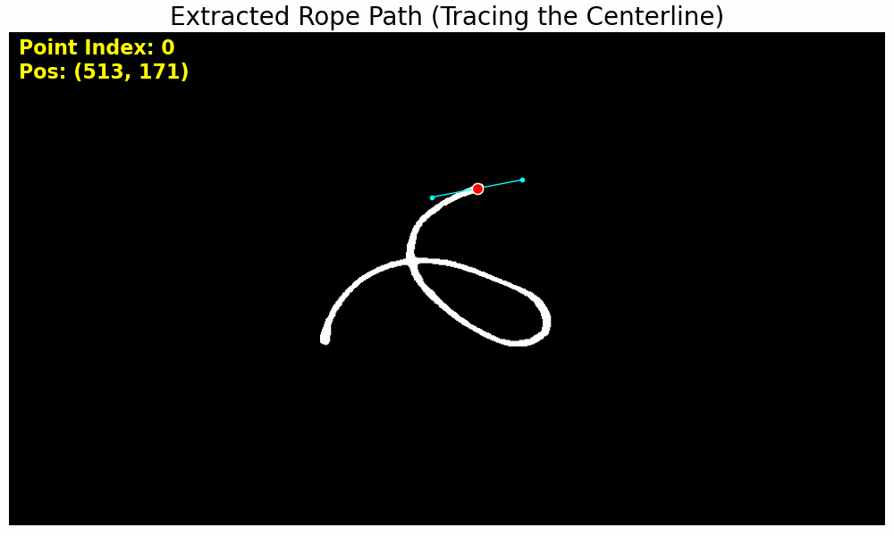
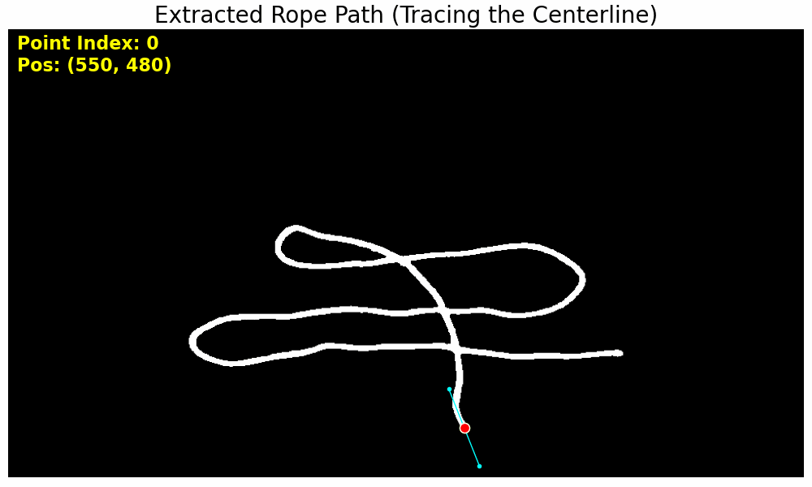
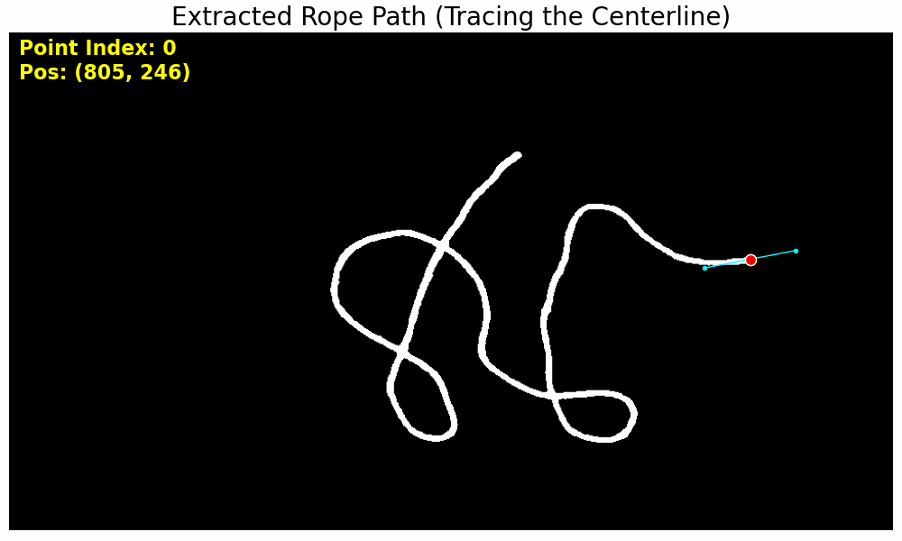
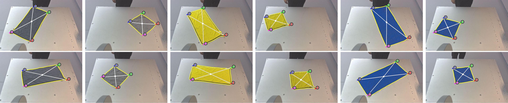

# DualArmRokae
This is a platform with a semi-humanoid fixed-base dual-arm manipulator, a Kingfisher R-6000 binocular camera and two Jodell Robotics RG75-300 parallel grippers. It has been utilized in our projects like [VLBiMan](https://hnuzhy.github.io/projects/VLBiMan), [BiDemoSyn](https://hnuzhy.github.io/projects/BiDemoSyn), and [VLBiMan++](https://hnuzhy.github.io/projects/VLBiManPlus).

  * **ICLR2026(arxiv2025.09)** VLBiMan: Vision-Language Anchored One-Shot Demonstration Enables Generalizable Bimanual Robotic Manipulation [[paper link](https://proceedings.iclr.cc/paper_files/paper/2026/hash/b6583edd75bc7d5fd21afb59837f0164-Abstract-Conference.html)][[project link](https://hnuzhy.github.io/projects/VLBiMan)]
  * **RSS2026(arxiv2025.12)** One-Shot Real-World Demonstration Synthesis for Scalable Bimanual Manipulation [[paper link](https://www.roboticsproceedings.org/rss22/p001.html)][[project link](https://hnuzhy.github.io/projects/BiDemoSyn/)]
  * **(arxiv2026.09)** VLBiMan++: Expanding the Generalization Boundary of Vision-Language Anchored One-Shot Bimanual Manipulation [[arXiv link](https://arxiv.org/abs/2609.14310)][[project link](https://hnuzhy.github.io/projects/VLBiManPlus)]

## Step 1: Hand-Eye Calibration
The hand-eye calibration referred to here is the calibration of the 4×4 transformation matrix for an "eye-to-hand" (or "eye-outside-hand") configuration. The primary objective is to transform 6-DoF poses from the head-mounted egocentric camera frame to the robotic arm's coordinate system (and vice versa). For further theoretical explanations, please refer to [arXiv](https://arxiv.org/abs/2311.12655) and [Wikipedia](https://en.wikipedia.org/wiki/Hand%E2%80%93eye_calibration_problem). In practice, we consistently use the left-eye view of the binocular stereo camera as the primary perspective for all calibration procedures. In the dual-arm manipulation platform, each robotic arm requires individual calibration. Additionally, we consistently use a concentric-circle calibration plate. Examples can be found in folders [saved_imgs_eeps_01/02](./handeye_calib/) or in the animated GIF below.

<table>
  <tr>
    <td align="center" width=50%> Hand-Eye Calibration of Left-Arm </td>
    <td align="center" width=50%> Hand-Eye Calibration of Right-Arm </td>
  </tr>
  <tr>
    <td align="center" width=50%></td>
    <td align="center" width=50%></td>
  </tr>
</table>

For the calibration scripts used in this project, please refer to [handeyeCalib.py](./handeye_calib/handeyeCalib.py) and [handeyeRlia.py](./handeye_calib/handeyeRlia.py). The former `handeyeCalib.py` is used to drive the robotic arm to assume 24 diverse poses—creating a variety of cases—and capture keyframes, while the latter `handeyeRlia.py` is used to invoke DexForce’s proprietary [rlia](https://huggingface.co/HoyerChou/YOTO/blob/main/wheels/rlia-0.3.4-cp310-cp310-manylinux_2_31_x86_64.whl) library for the quick and convenient calibration of transformation matrices. In the absence of errors, the calibration accuracy (e.g., Reprojection Error) is typically around 0.1 cm or better. 

## Step 2: One-Shot Demonstration
We collect one-shot demonstrations via kinesthetic teaching: an operator manually guides both arms through task-critical waypoints, recording the 6-DoF end-effector poses (relative to each robot base frame) and gripper binary states at each pause. Objects are placed in fixed initial configurations (allowing small positional tolerance) to ensure consistency. The recorded waypoints are then executed autonomously by the robot control API, which solves inverse kinematics between consecutive given poses and synchronizes gripper actions (e.g., closing after reaching a pre-grasp pose). During auto-execution, stereo camera observations (10Hz) and dual-arm joint/end-effector states are logged. For the real rollout effect of the one-shot demonstration related to each task, please refer to our projects [VLBiMan](https://hnuzhy.github.io/projects/VLBiMan) or [BiDemoSyn](https://hnuzhy.github.io/projects/BiDemoSyn/). Finally, demonstrations are deconstructed into task-aware blocks to support subsequent adaptive reusing and trajectory synthesis.

We primarily defined and implemented six previously bimanual tasks (which are the same as in [DualArmAubo](https://github.com/hnuzhy/BiRoMan/tree/main/DualArmAubo) for **cross-embodiment transferring experiments** and include `plugpen`, `inserting`, `unscrew`, `pouring`, `handover`, and `unscrew+pouring`) and nine newly bimanual tasks on this dual-arm platform: `flatting`, `reorient`, `flipping`, `upright`, `place bottle_mug`, `place fork_spoon`, `zip penbag`, `coil cable`, and `fold towel`. The keyposes or waypoints generated after a single one-shot demonstration of each task are recorded in a config file. Please refer to the file [config.py](./src/config.py) for details. Regarding the initial pose and placement of the objects to be manipulated for each task, please refer to the folder [results](./results/).

## Step 3: Environment Configuration
Following the initial calibration and demonstration phases, this project requires the configuration and installation of specific Vision-Language Models (VLMs) or Vision Foundation Models (VFMs). Only one choice is employed in this platform. We choose to leverage the mature and powerful VLM model [Florence-2 (CVPR2024)](https://arxiv.org/abs/2311.06242) and VFM model [SAM2 (ICLR2025)](https://arxiv.org/abs/2408.00714) separately. This enables more robust and precise detection and segmentation of target objects. Regarding usage: although `ultralytics` integrates [SAM2](https://docs.ultralytics.com/zh/models/sam-2), it does not support text prompt inputs. Therefore, I recommend downloading the weights for [Florence-2-base](https://huggingface.co/microsoft/Florence-2-base) and [SAM2-hiera-small](https://huggingface.co/facebook/sam2-hiera-small) yourself, and then using the [scripts](./src/utils/) provided in this project to implement the combined `Florence-2 + SAM2` solution.

## Step 4: Dynamic Closed-Loop Manipulation
Next, we move to the execution phase of bimanual manipulation. Here, we primarily demonstrate how to achieve training-free, robust, and generalizable manipulation—based on a `one-shot demonstration`—that handles disturbances (this corresponds to the full workflow discussed in [VLBiMan](https://hnuzhy.github.io/projects/VLBiMan)). For the approach of using a trained visuomotor policy to predict the sequence of all future bimanual keyframes (as seen in [BiDemoSyn](https://hnuzhy.github.io/projects/BiDemoSyn/)), one can refer to the [BiDP](https://github.com/hnuzhy/YOTO/tree/main/BiDP) algorithm previously proposed in [YOTO](https://hnuzhy.github.io/projects/YOTO). 

Specifically, we implemented two closed-loop control schemes in scripts [bashRunV1.sh](./bashRunV1.sh) and [bashRunV2.sh](./bashRunV2.sh). These two schemes are almost identical, the difference being that `bashRunV1.sh` only drives the robot to rollouts without recording real-time streaming observations from the egocentric camera, while `bashRun2.sh` additionally records the egocentric camera video stream synchronously throughout the entire rollout process and automatically outputs it in video format at the end. Furthermore, different parameters can be specified for both scripts, including the dual-arm task name, the IDs of the objects involved, and whether user interaction is permitted during the manipulation process. To achieve closed-loop control, consistent with the methodology described in the [VLBiMan](https://hnuzhy.github.io/projects/VLBiMan) paper, we focus on addressing changes in the target object's pose during the `pre-grasping` phase. By comparing the current state against the `seed pose` from the one-shot demonstration, we calculate positional offsets or rotational changes to derive a new 6-DoF grasping pose. Since these computations are performed with minimal CPU overhead, the system enables high-frequency, robust closed-loop control.

## Step 5: Perception of Non-Rigid Objects (VLBiMan++)
Unlike the [DualArmAubo](https://github.com/hnuzhy/BiRoMan/tree/main/DualArmAubo), this platform enables an in-depth analysis of more complex and variable non-rigid objects—specifically, how to achieve effective and controllable visual perception and understanding of them. Concretely, we focus on one type of articulated object (the `penbag` in the `zip penbag` task) and two types of deformable objects (the `linear cable` in the `coil cable` task and the `rectangular towel` in the `fold towel` task). Following the detailed methodology of [VLBiMan++](https://hnuzhy.github.io/projects/VLBiManPlus), we employ a body-part relational representation for the articulated `penbag`, while using boundary-based topological analysis to extract anchor points for the `cable` and `towel`. For implementation details, please refer to the usage functions `RopeSkeletonExtractor` and `find_dense_corners_of_a_deformable_cloth` in [util.py](./src/util.py) as well as the key algorithms [rope_uncross.py](./src/algs/rope_uncross.py) and [slots_v1.py](./src/algs/slots_v1.py). Examples of typical case outcomes are shown in the animated GIF and figure below.

<table>
  <tr>
    <td align="center" width=50%> Cable Case 1 </td>
    <td align="center" width=50%> Cable Case 2 </td>
  </tr>
  <tr>
    <td align="center" width=50%></td>
    <td align="center" width=50%></td>
  </tr>
  <tr>
    <td align="center" width=50%> Rope Case 1 </td>
    <td align="center" width=50%> Rope Case 2 </td>
  </tr>
  <tr>
    <td align="center" width=50%></td>
    <td align="center" width=50%></td>
  </tr>
</table>

