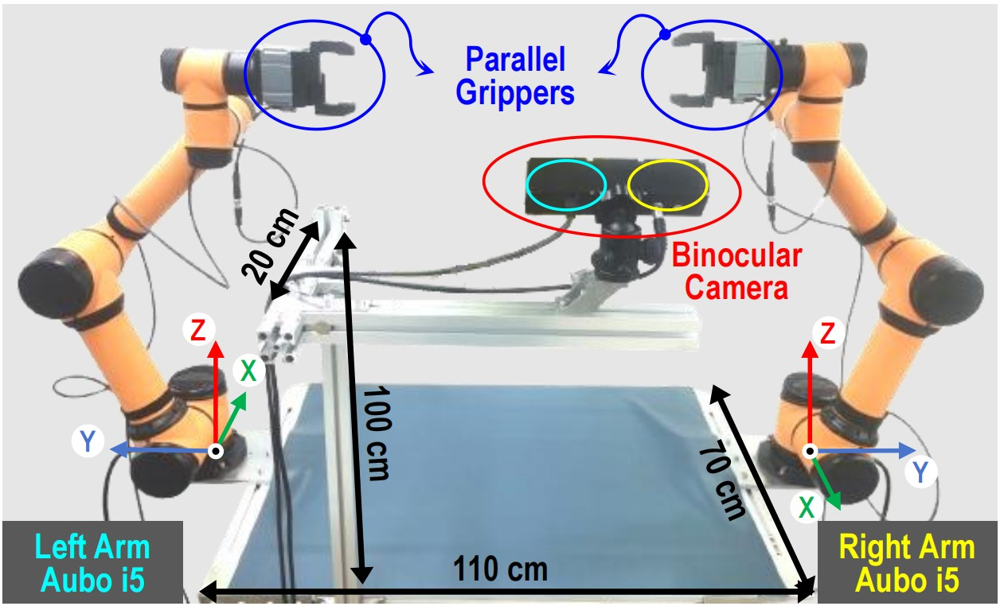
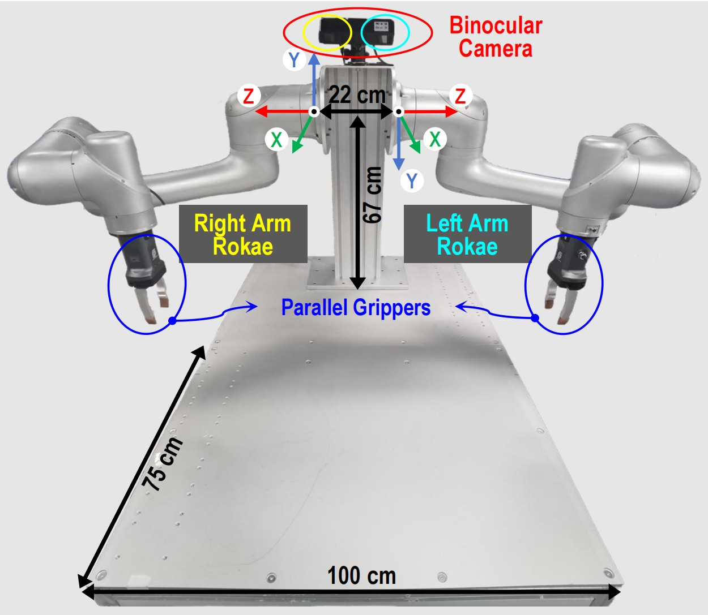

# BiRoMan
The codebase for developing modular Bimanual Robotic Manipulation using dual-arm platforms

<table>
  <tr>
    <td></td>
    <td></td>
  </tr>
</table>

## ● Platform 1: [DualArmAubo](./DualArmAubo)


## ● Platform 2: [DualArmRokae](./DualArmRokae)


## ● Acknowledgement


## ● Citation
If you use our code in your research, please cite with:
```
% VLBiMan++ (arxiv2026.09)
@article{zhou2026vlbiman++,
  title={VLBiMan++: Expanding the Generalization Boundary of Vision-Language Anchored One-Shot Bimanual Manipulation},
  author={Zhou, Huayi and Gao, Wei and Han, Yiyang and Jia, Kui and Huang, Hui},
  journal={arXiv preprint arXiv:2609.xxxxx},
  year={2026}
}

% VLBiMan (ICLR2026)(arxiv2025.09)
@inproceedings{zhou2026vlbiman,
  title={VLBiMan: Vision-Language Anchored One-Shot Demonstration Enables Generalizable Bimanual Robotic Manipulation},
  author={Zhou, Huayi and Jia, Kui},
  booktitle={International Conference on Learning Representations (ICLR)},
  volume={2026},
  pages={112330--112360},
  year={2026}
}

% BiDemoSyn (RSS2026)(arxiv2025.12)
@inproceedings{zhou2026one,
  title={One-Shot Real-World Demonstration Synthesis for Scalable Bimanual Manipulation},
  author={Zhou, Huayi and Jia, Kui},
  booktitle={Proceedings of Robotics: Science and Systems (RSS)},
  year={2026},
  address={Sydney, Australia}, 
  month={July}, 
  doi={10.15607/RSS.2026.XXII.001} 
}
```
